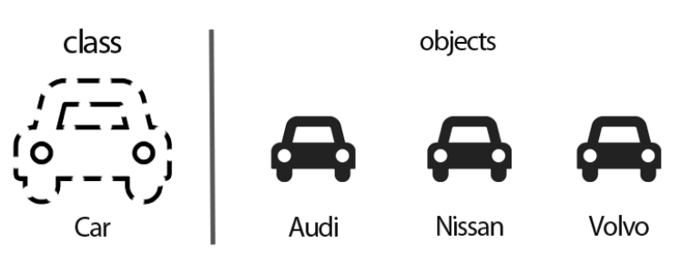
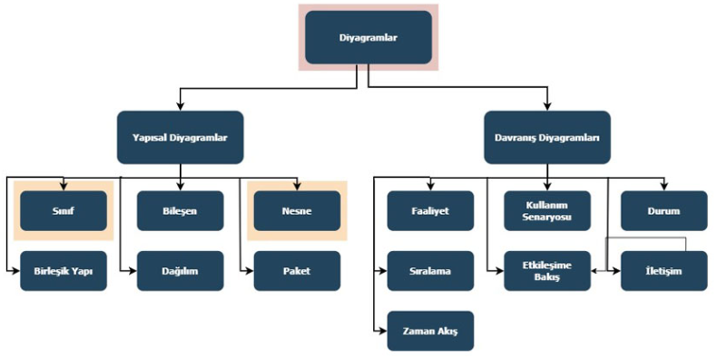
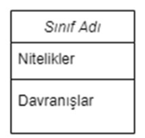
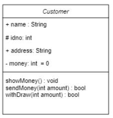
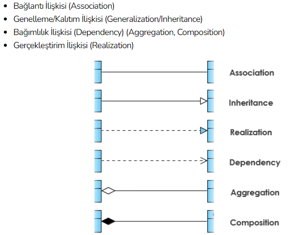
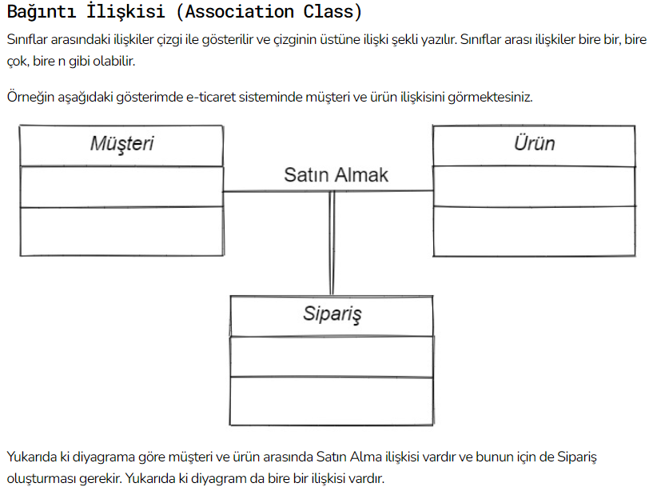
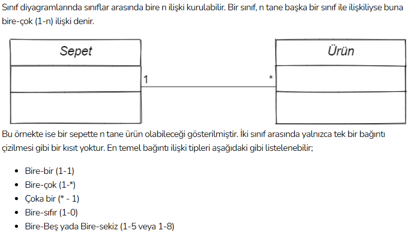
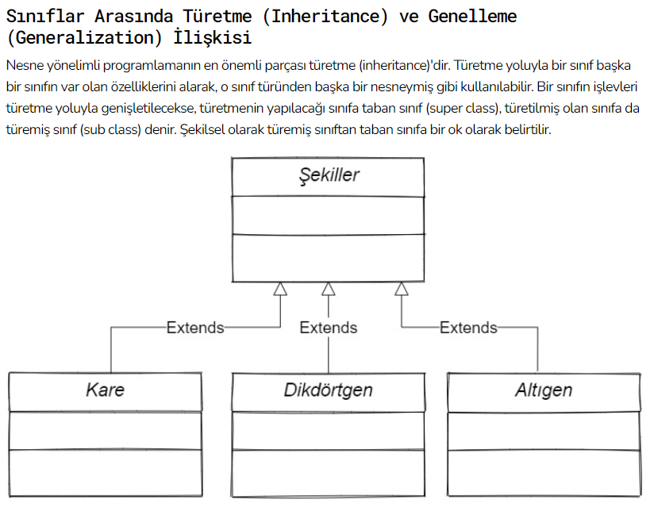
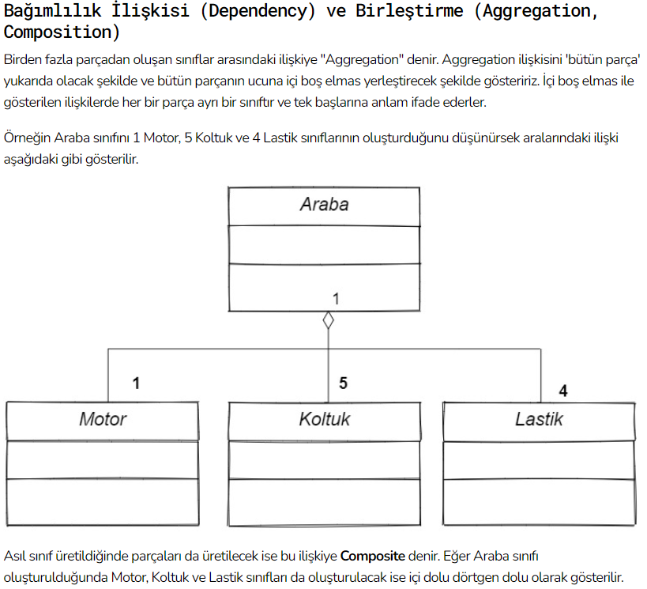
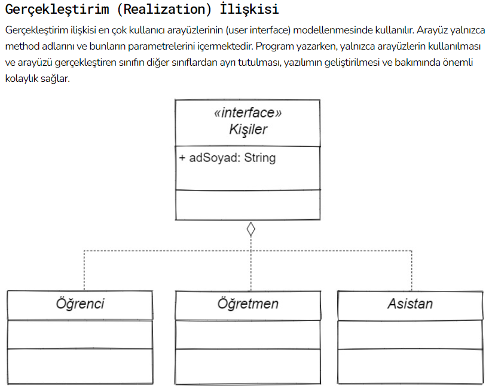

###### ***Kısa bir özet;***
## Nesne Yönelimli Proglamlama
###### Nitelik : Nitelik kavramı, bir nesnenin özellikleridir ve nesnenin mevcut durumunu tanımlar. ***Mesela bir ördeğin rengi ve ağırlığı o ördeğin nitelikleridir.*** Bir ördeğimizin rengi siyah, diğer ördeğimizin rengi beyazdır. Bu durumda her iki nesne (yani ördek) nitelikleri sebebi ile birbirilerinden bağımsızdırlar.
###### Davranışlar : o objenin nelerle ilgileneceğini gösterir. 

### Class
###### Arabalar üzerinden örnek verecek olursak bir araba sınıfımız varsa bu araba sınıfından oluşturulan, Auidi, Mercedes ve BMW model arabaları objemiz olurlar.
***~~~~~~~~~~***

***~~~~~~~~~~***

## UML MODELLEME
### Modelleme nedir ?
###### Bir projeye başlamadan tasarlanan projedir, üzerinde değişikler yapılır hatalar gözlemlenir ve düzeltilir.
### UML (Unified Modeling Language) Nedir ?

 

