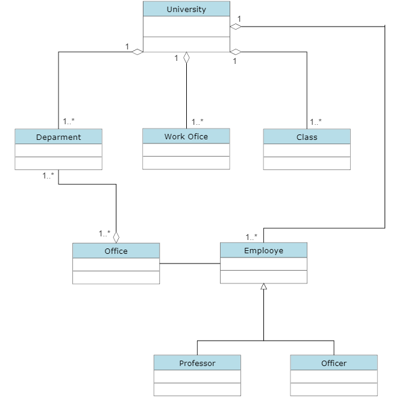

## University Management System

##### 1 - Üniversite bir çok departman, sınıf, çalışma sınıfı ve çalışan barındırır.
##### 2 - Üniversite çalışanlarının hepsinin bir ofisi vardır.
##### 3 - Çalışanlar profesör ve memur olarak ikiye ayrılır.
##### 4 - Ofisler departmanlara bağlıdır.
